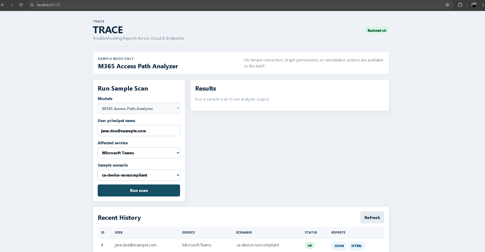
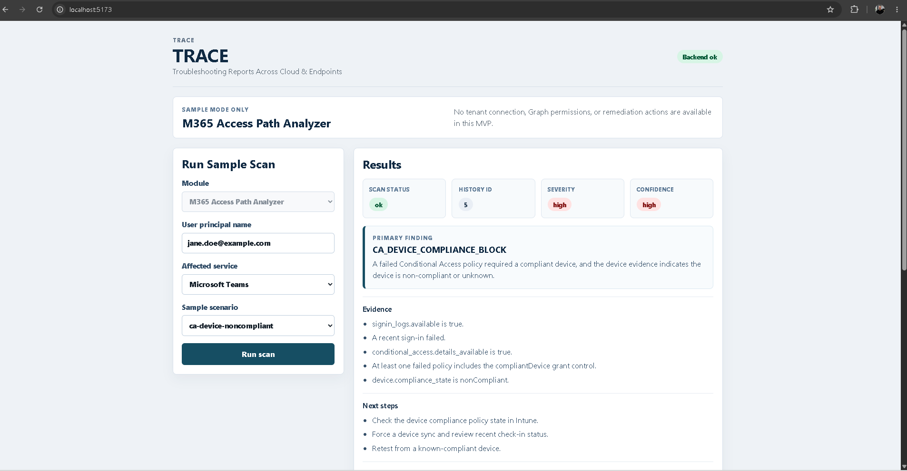
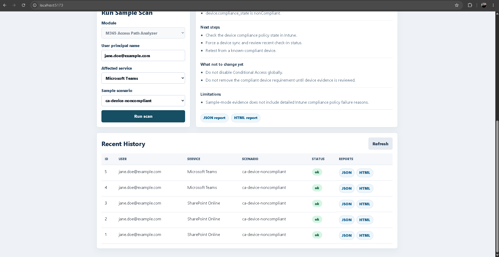
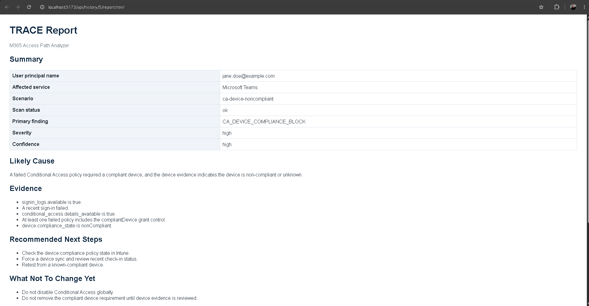

# TRACE

**Troubleshooting Reports Across Cloud & Endpoints**

TRACE is a local-first IT Operations diagnostic toolkit that helps support engineers turn scattered Microsoft 365, Entra ID, endpoint, DNS, mail flow, and infrastructure signals into clear evidence-based troubleshooting reports.

The current MVP is a local sample-mode implementation of the first module, **M365 Access Path Analyzer**.

## Current MVP Status

TRACE currently supports an end-to-end synthetic workflow:

- PowerShell collector scripts load sample JSON evidence.
- The FastAPI backend validates collector output, runs deterministic analyzer rules, stores local SQLite history, and serves JSON/HTML reports.
- The React + TypeScript + Vite frontend calls the backend API, displays analyzer results, shows recent history, and links to saved reports.

This MVP does not connect to Microsoft Graph or a real Microsoft 365 tenant.

## First Module: M365 Access Path Analyzer

M365 Access Path Analyzer investigates Microsoft 365 access failures by correlating:

- identity status
- licensing
- MFA/authentication signals where available in evidence
- recent sign-in logs
- Conditional Access results
- device compliance evidence

The goal is to explain why a user cannot access Microsoft 365 resources and provide support-ready next steps with evidence, confidence, and limitations.

## Architecture Overview

```text
trace-ops/
|-- collector/   PowerShell sample-mode evidence collector
|-- backend/     Python FastAPI API, analyzer, SQLite history, reports
|-- frontend/    React + TypeScript + Vite local UI
|-- samples/     Synthetic scenario JSON used by tests and demos
|-- specs/       Product, technical, permissions, and test plans
`-- docs/        Supporting project assets
```

Data flow:

```text
Frontend -> Backend API -> PowerShell collector sample mode -> Backend validation
         -> Analyzer rules -> SQLite history -> JSON/HTML reports -> Frontend
```

For the current MVP architecture diagram, see [docs/architecture.md](docs/architecture.md).

## Safety Boundaries

Current MVP boundaries:

- sample mode only
- no Microsoft Graph calls
- no tenant connection
- no delegated authentication flow yet
- no remediation
- no attack simulation
- no token, password, or secret storage

TRACE is not a tenant-wide security scanner, attack simulation platform, or automatic remediation tool.

## Run Collector Tests

From the repository root:

```powershell
powershell -NoProfile -ExecutionPolicy Bypass -Command "Invoke-Pester -Script .\collector\tests\Invoke-TraceM365AccessScan.Tests.ps1"
```

The collector currently reads synthetic sample data from `samples/` and outputs structured JSON.

## Run Backend Tests

From the repository root:

```powershell
cd C:\Users\ralba\Documents\GitHub\trace-ops\backend
python -m venv .venv
.\.venv\Scripts\Activate.ps1
python -m pip install -r requirements.txt
python -m pytest
```

## Run Backend

```powershell
cd C:\Users\ralba\Documents\GitHub\trace-ops\backend
.\.venv\Scripts\Activate.ps1
python -m uvicorn app.main:app --reload
```

Backend URL:

```text
http://127.0.0.1:8000
```

Current backend endpoints include:

- `GET /api/health`
- `GET /api/modules`
- `POST /api/scan/user-access`
- `GET /api/history`
- `GET /api/history/{history_id}/report.json`
- `GET /api/history/{history_id}/report.html`

Local SQLite history is stored at `backend/data/trace_history.sqlite3`. Local database files are ignored by Git.

## Run Frontend

In a second terminal, after the backend is running:

```powershell
cd C:\Users\ralba\Documents\GitHub\trace-ops\frontend
npm install
npm run build
npm run dev
```

Frontend URL:

```text
http://127.0.0.1:5173
```

The frontend Vite dev server proxies `/api` requests to the local backend.

## Demo Flow

A short portfolio/demo walkthrough is available in [docs/demo-script.md](docs/demo-script.md).

The demo uses the synthetic `ca-device-noncompliant` scenario for `jane.doe@example.com` and shows how TRACE explains a Conditional Access compliant-device block, evidence, safe next steps, what not to change yet, and local JSON/HTML report links.

It is a local sample-mode demo only: no Microsoft Graph calls, no tenant connection, and no remediation.

## Screenshots

These screenshots use synthetic sample data from the local sample-mode MVP. They do not show real tenant data and do not require Microsoft Graph or a Microsoft 365 tenant connection.



TRACE home screen showing the product header, backend health, M365 Access Path Analyzer module, sample-mode notice, and scan form.



Analyzer result for the synthetic `ca-device-noncompliant` scenario, showing the Conditional Access compliant-device finding, evidence, next steps, safe non-actions, confidence, and limitations.



Recent local scan history with saved synthetic scan records and JSON/HTML report links.



Generated local HTML report for the synthetic scan, suitable for support handoff or ticket documentation.

## Current Frontend Capabilities

The UI currently supports:

- backend health status
- TRACE and M365 Access Path Analyzer module display
- sample scan form with known synthetic scenarios
- analyzer result display
- primary finding, severity, confidence, likely cause, evidence, next steps, what not to change yet, and limitations
- recent local scan history
- JSON and HTML report links for saved scan history records

There is no tenant connection UI and no Microsoft Graph permissions UI yet.

## Current Limitations

- Evidence comes from synthetic JSON files only.
- Real Microsoft Graph collection is not implemented.
- Authentication and permission checks are not implemented.
- SQLite history is local development storage, not a multi-user data store.
- Report generation is limited to JSON and HTML.
- Future TRACE modules are described in specs but are not implemented.

## Future Roadmap

Planned operational work includes a read-only **User Access Health Scanner** for proactive access-readiness checks. The first version should scan an explicit CSV list of users, with Entra ID group scanning later. On-prem AD OU scanning may be considered later for hybrid/on-prem environments only, because Entra ID does not use classic OUs.

## Portfolio Value

TRACE demonstrates a practical IT Operations troubleshooting workflow: collecting evidence, validating contracts between layers, applying deterministic diagnostic rules, storing local history, and producing support-ready reports. The project is intentionally framed around safe, read-only diagnosis rather than remediation or offensive simulation.

## Development Approach

This project follows a specs-driven development workflow. Before implementation tasks, read `AGENTS.md` and the files in `specs/`.
