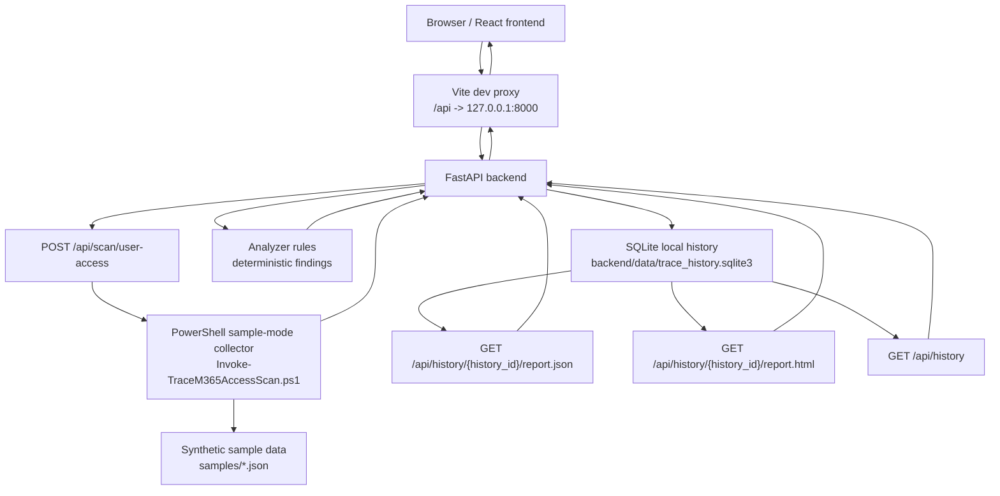

# TRACE Local MVP Architecture

This document describes the verified TRACE local sample-mode MVP for the M365 Access Path Analyzer.

The current MVP uses synthetic sample data only. It does not call Microsoft Graph, connect to a Microsoft 365 tenant, perform remediation, or include attack simulation.

## Architecture Diagram



## Current Flow

1. The user opens the React frontend locally.
2. The frontend sends API requests through the Vite development proxy.
3. The FastAPI backend receives the scan request at `POST /api/scan/user-access`.
4. The backend runs the PowerShell collector in sample mode only.
5. The collector reads synthetic JSON from `samples/` and returns normalized JSON.
6. The backend validates the collector output.
7. Deterministic analyzer rules create support-ready findings.
8. The backend saves the full scan response to local SQLite history.
9. The frontend displays the result and recent history.
10. JSON and HTML report endpoints generate reports from saved local scan history.

## Local-Only Storage

SQLite history is stored locally at:

```text
backend/data/trace_history.sqlite3
```

This storage is for local sample-mode scan history. It must not store access tokens, refresh tokens, passwords, client secrets, or raw credentials.

## Report Generation

Reports are generated from saved local scan history:

- `GET /api/history/{history_id}/report.json`
- `GET /api/history/{history_id}/report.html`

The report layer does not re-run collection. It formats an already saved scan response and analyzer output.

## Explicit Non-Goals In The Current MVP

The current MVP does not include:

- Microsoft Graph calls
- Microsoft 365 tenant connection
- delegated authentication
- permission consent flows
- automatic remediation
- attack simulation
- cloud-hosted processing

Future real Microsoft Graph collection must preserve the normalized collector contract used by the sample-mode workflow.
